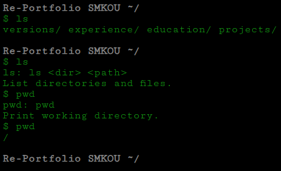
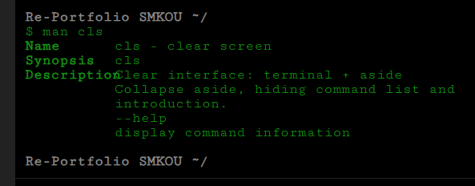
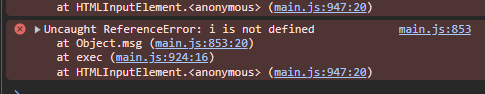

# Re-Portfolio

By: Stella Marie (SmKou)

Collection of portfolios since 2015
View on [Github Pages](smkou.github.io/re-portfolio)

## Description

Re-Portfolio is a static portfolio website, featuring a collection of portfolios. These portfolios are presented as versions and each version has its own design. For example, one may be in the style of a newspaper and another may be in the style of an index. To avoid redundancy of content, some may seem missing from one version to another. Updates will be noted on the homepage.

Homepage: Terminal interface
Versions: TV channels
0.	The Profile
    - personality
    - appearance
    - stats
    - favorites
1.	The Magazine
    - projects
2.	Design Index
    - notes
3.	Presentation
    - intro
    - interests
    - work ethic
    - why
4.	Pages
    - aesthetic
5.	Resume
    - overview

## Complete Setup

Use for CSS minification: [Toptal](https://www.toptal.com/developers/cssminifier)
Use for JS minification: [Minify](https://minify-js.com/)
Use for image compression: [Optimizilla](https://imagecompressor.com/)

Deploy to Github Pages from subdirectory
```bash
git subtree push --prefix app origin gh-pages
```
Note: Do not merge from main or checkout the gh-pages branch

## Known Bugs

**Bug: UI input border-top**
- Only appears when active

**Bug: Missing Line**

- click: ls
- click: pwd
- input: pwd

**Implement: Homepage Commands**
- dir
  Show contained subdirectories and files, root: portfolio, req. dir DIRECTORY to change root, uses --f to only show contained files
- echo
  Show file messages (status, comment, dev remarks), default: show only status
- find
  Search a directory for a string appearing in file properties and data, does not consist of equivalence, may use --p to search only file props and --v to only search file data
- lynx
  Follow file url, opens url in another host in another tab, displays list of urls if file has more than one (note: -m for listing all recent urls associated with file and -a for listing all urls, including backups and iterations)
- more
  Show file data, use -m to include file messages
- stat
  Show file properties, use -d to include file data and -m to include file messages
- tree
  Print structural representation of directories and files

**Bug: Overlapping page text**

- command: man

**Bug: Msg: Not defined error**

- command: msg

**Test: Homepage Commands**
- use of &&
- may be bug

### To-Do
- **Modify: Quick Navigation**
- **Review data (note: description, dev, etc)**
- **Redesign: Versions page**

## License

Re-Portfolio © 2024 by Stella Marie (Sm Kou) is licensed under CC BY-NC-ND 4.0

Re-Portfolio is licensed under a
Creative Commons Attribution-NonCommercial-NoDerivatives 4.0 International License

[License](https://creativecommons.org/licenses/by-nc-nd/4.0/)
[Legal Code](https://creativecommons.org/licenses/by-nc-nd/4.0/legalcode.en)
